# Practical Assignment 2
## What drives the price of a car?

## Summary
In this analysis, I did some investigation on the provided data to identify key features that drive the price of a car.

I'm leveraging the CRISP-DM framework for the process of my analysis which have several steps from business & data understanding, data preparation, modeling, evaluation and finally deployment. 

Part of understanding the data, I also had to do some data clean-up, since there are quite a number of missing data. I dropped several columns that have a lot of missing data and not useful such as VIN, cylinder, size, etc. The rest of missing data, I filled with median for numerical data and most frequent values for categorical data.

I use data visualization (plot) in order to easily understand some of the data distribution for example: car by year, price, odometer, etc. The following shows several plot that visualize distribution for some features of the data:

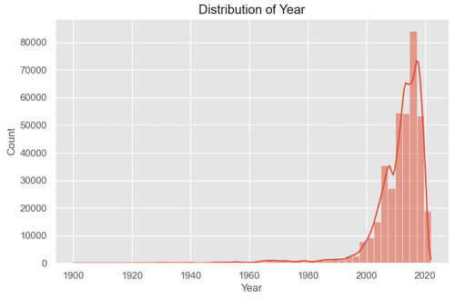
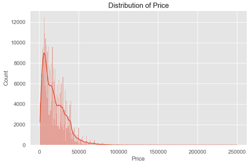
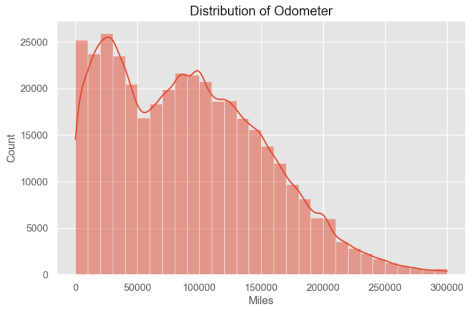
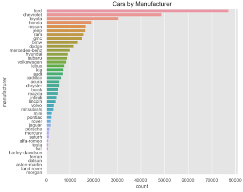
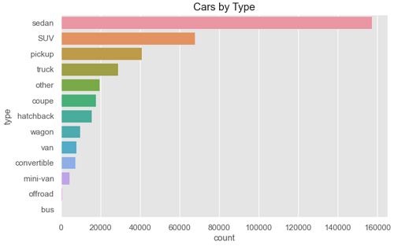
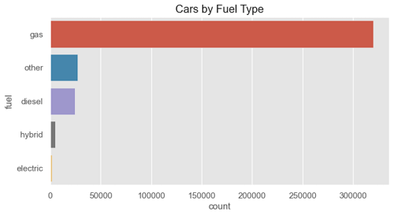
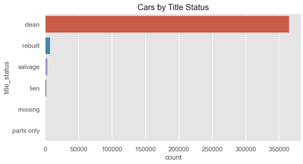
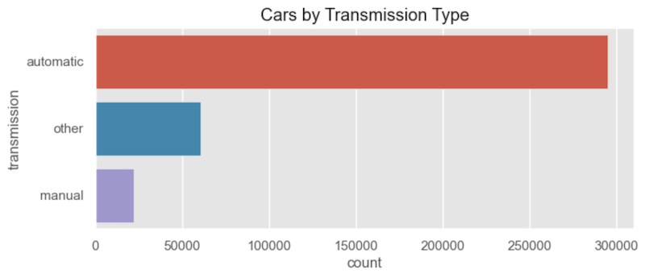

The next plots visualize the correlation between Price & Odometer and price & Year:

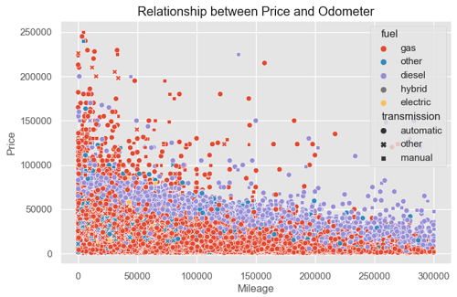
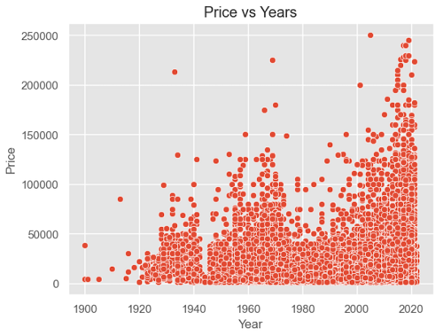

For the modelling, I used **Linear**, **Ridge**, and **Lasso Regression**. In order to improve the result of prediction score, I tried **GridSearchCV** to find best parameter so that I can plug-in the best Hyperparameter back into the model to see if it improved the scoring. 

For my scoring, I used **MAE** and **R^2**. Since I didn't satisfy with the scoring result, I experimented with **RandomForestRegressor** and I did get better result with this algorithm. For this algorithm, I tried to improve it by finding best parameter using **RandomSearchCV** and I didn't use **GridSearchCV** because the combination of my Hyperparameter took too long to get the result. With RandomSearchCV, I ended up didn't get better result because it didn't try all the combination, I only used **25 iterations**.

Finally, I produced the feature importance from my model result so I can come up with some conclusion.

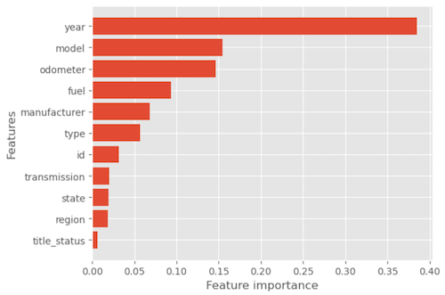

## Recommendation

Based on my investigation and by looking at the result of my analysis specifically the feature importance, there are several factors that drive car prices and the top four that I suggest are:
- The newer (year) the car the higher the prices and this more logical for the same car model.
- Cars with different model (or brand) may affect the price also because certain brands may be luxury brand or may be popular but hard to get.
- Cars with lower mileage (Odometer) affect higher prices.
- Certain fuel type such as Hybrid or Electric may impact the price because it can save gas cost for customers.

